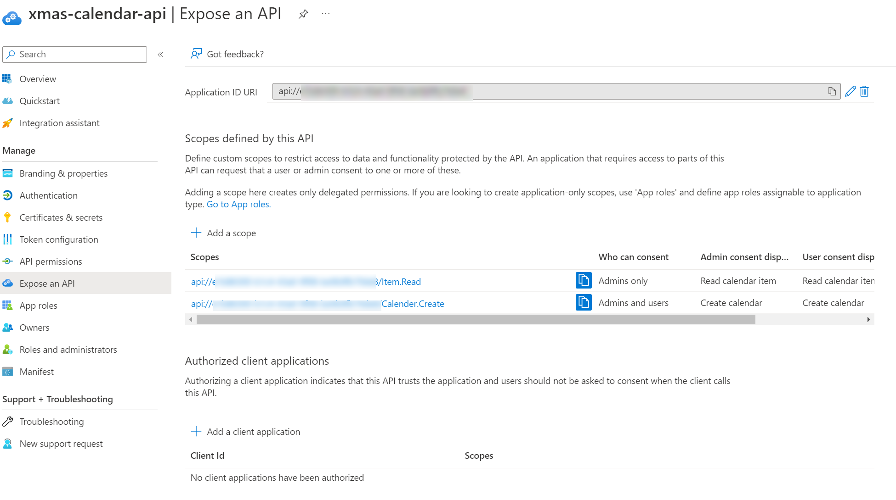
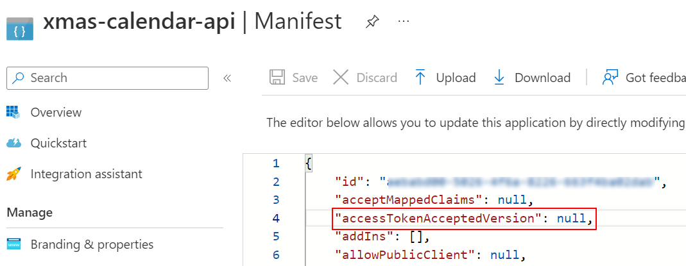
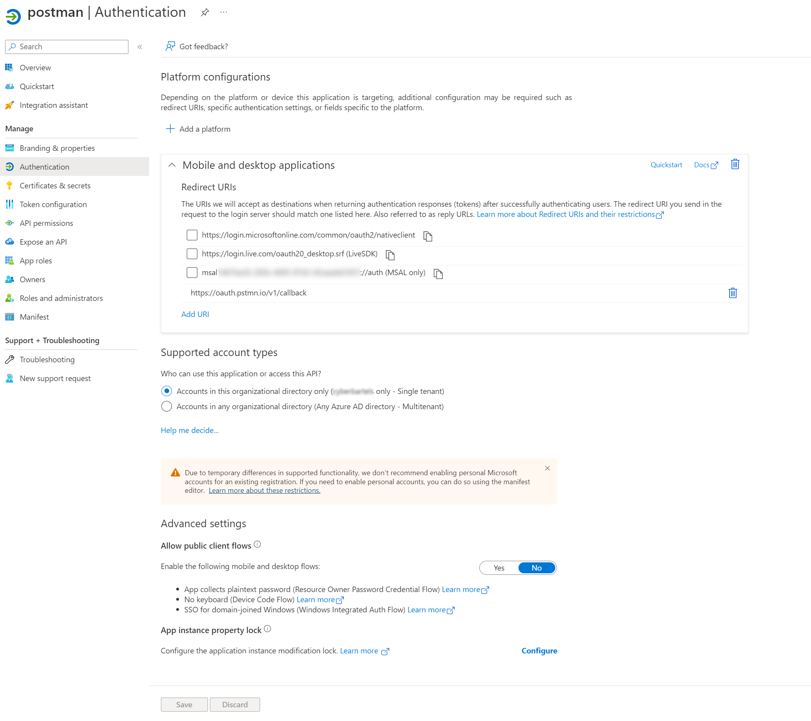
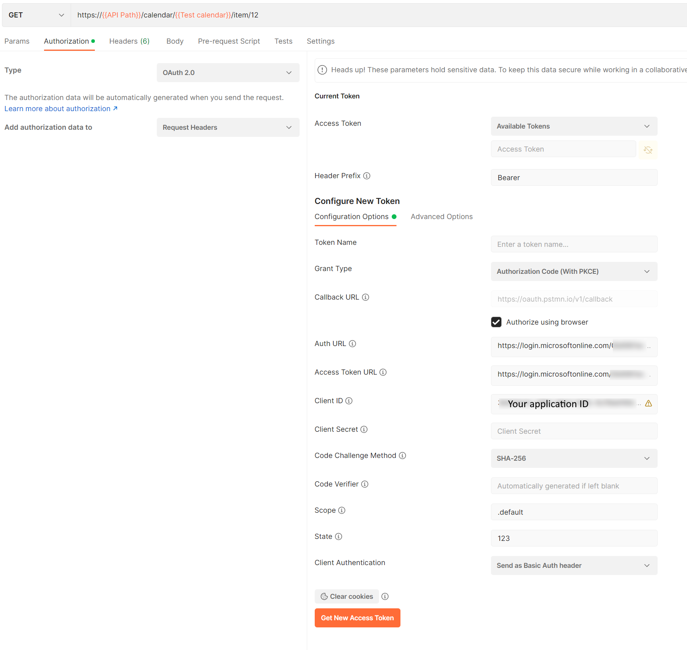
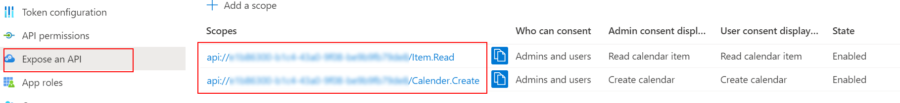
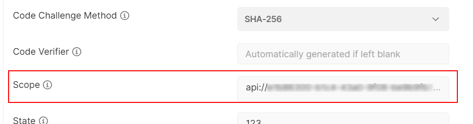
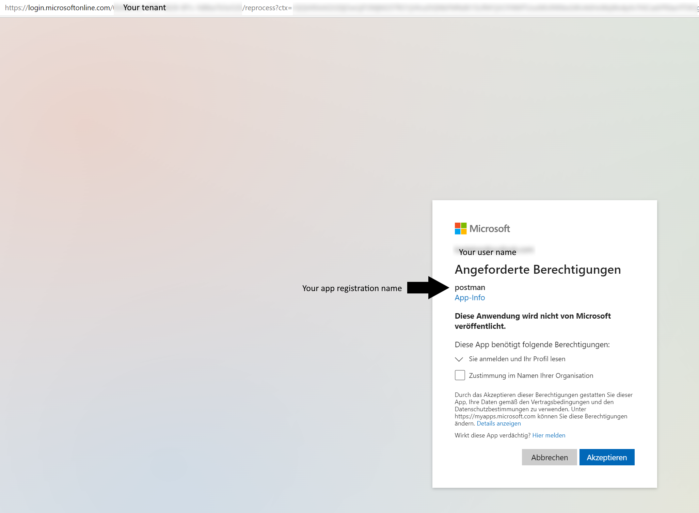

# Introduction
This projects generates an API toy model. The idea is to create a small REST API and publish it wit an API management. While the API does not check any authorizations other than a global, all purpose key, the API management is endowed with the task to protect the API and to authorize access. The API management uses the global key to access the API, no other entity should call the API directly.
## Technical components
Azure...
That said, the API is an Azure function app, the API management the (consumption based) Azure API management (apim). 
Authorization on a user level is handled by OAuth flows which may be readilly implemented with the help of Azure Active Directory.
## Azure Active Directory
Azure Active Directory (AAD) may be used as Identity Provider (IdP).
### Register API
Create an app registration for the API. 

Later we will protect the API by API Management policies. To avaoid the mismatch between AAD's well known configuration and the token issuer, we need to modify the app's manifest.

 
Set the value of accessTokenAcceptedVersion to 2:

    "accessTokenAcceptedVersion": 2,

### Register test client
For test purposes, create a client for your test tool. This example uses Postman. Postman allows to retrieve OAuth tokens for authorization code flows. The desktop application calls the IdP providing a redirect URL https://oauth.pstmn.io/v1/callback. So the registered app in AAD should encompass this URL.

Note that the app is registered as a "Mobile and desktop application".

### Authorize

Add desired scopes as defined in your API's app registration

    api://<API app registration application id>/Item.Read
    api://<API app registration application id/Calender.Create

